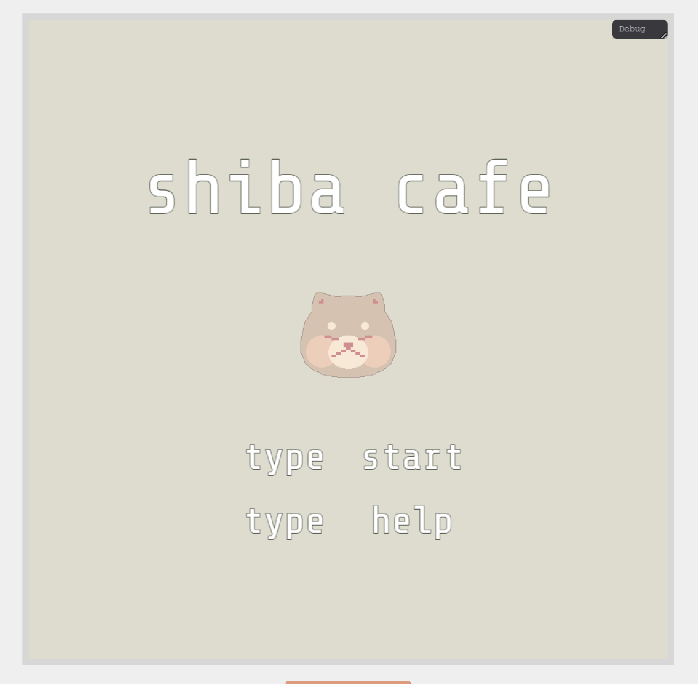
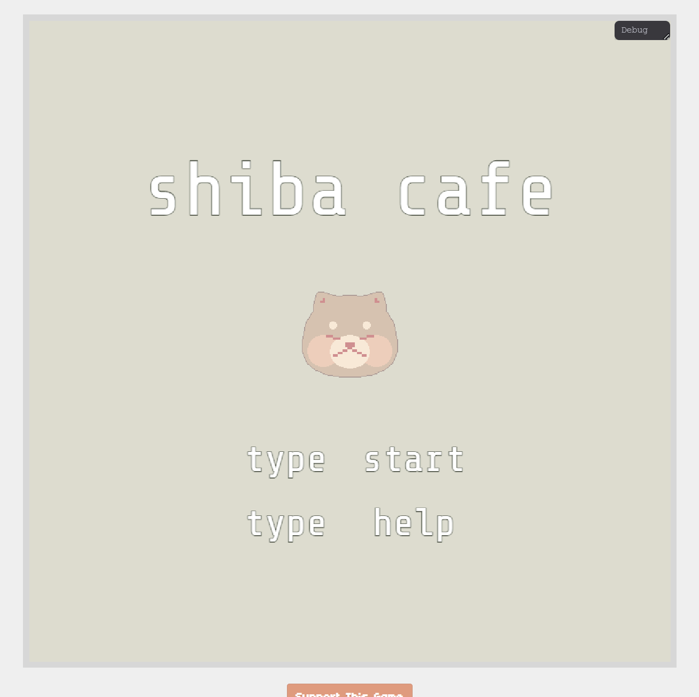
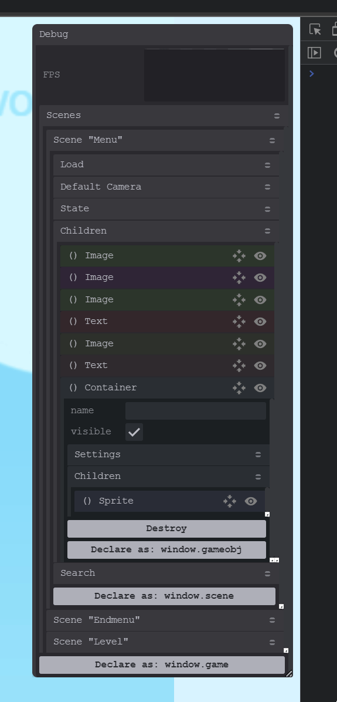
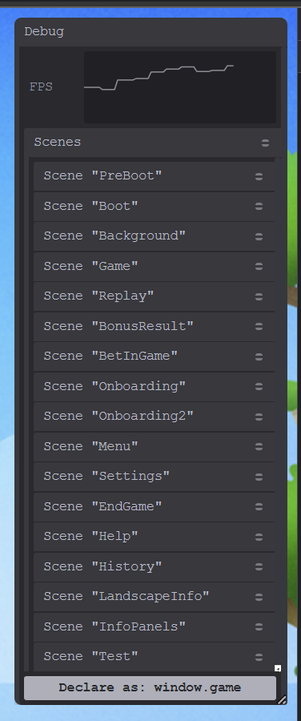
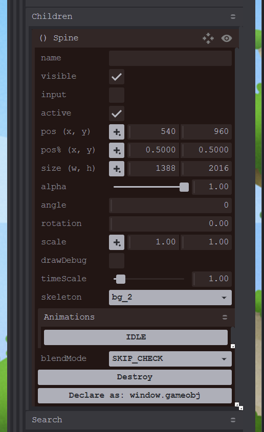
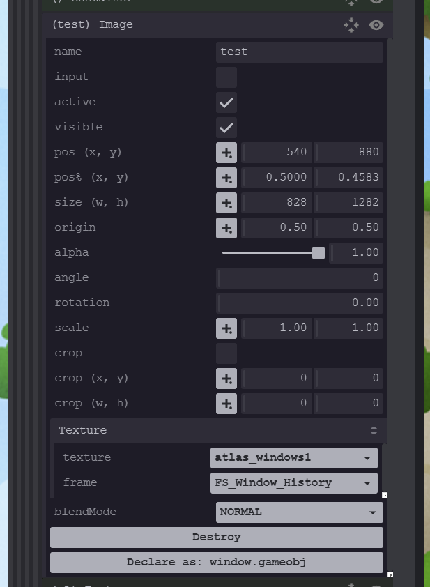
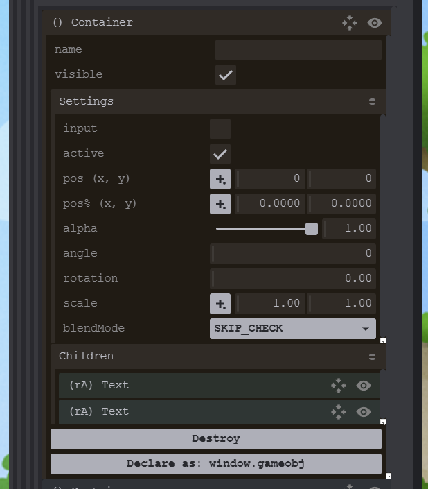
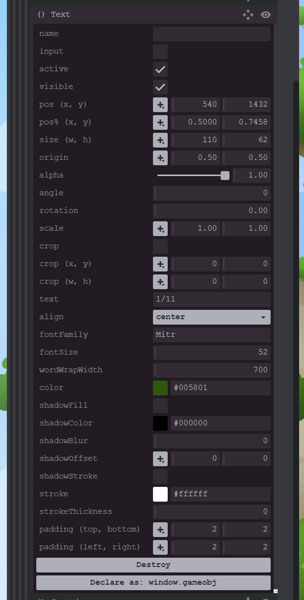

## About

If Phaser is found on the page, you will see `Phaser debug is enabled` message in console, at this point
the injection occurs. Then you will get `Phaser debug is attached` if Game was successfully started.

Extension button on the right side of the screen which will show a list of available scenes & FPS.

## Links

Chrome Store: https://chrome.google.com/webstore/detail/phaser-debugger/aigiefhkiaiihlploginlonehdafjljd

## Showcase

## Build

Install the project: `npm install`

Chrome: `npm run build-chrome`
Firefox: `npm run build-firefox`

## Installation

### Chrome

1. Open Extension tab `chrome://extensions/`
2. Enable Developer Mode on top right corner
3. Press "Load Unpacked Extension"
4. Choose `dist` project folder
5. Refresh game tab
6. Left top corner you will see "Debug" button

### Firefox

1. Open Debug tab `about:debugging#/runtime/this-firefox`
2. Click on "Load Temporary Add-on"
3. Choose manifest.json inside `dist` project folder
4. Refresh game tab
5. Left top corner you will see "Debug" button

## TODO

1. Fix firefox perfomance issue
2. Add mesh suppport
3. Add tweens support
4. Add button to export game obj data
5. Add section to create new game objects
6. Add section to create new tweens
7. Add time scale into scene
8. Dynamic "declare as gameobj" - allow you to assign any name
9. Windowed mode - add a button that opens the game object in a separate and customizable window
